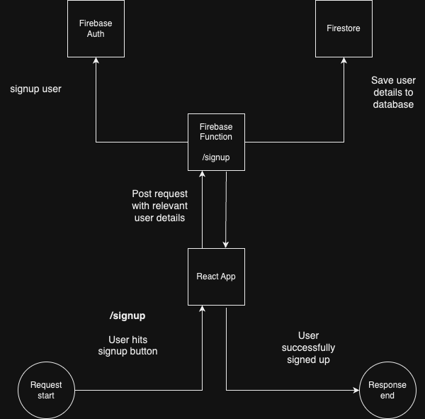
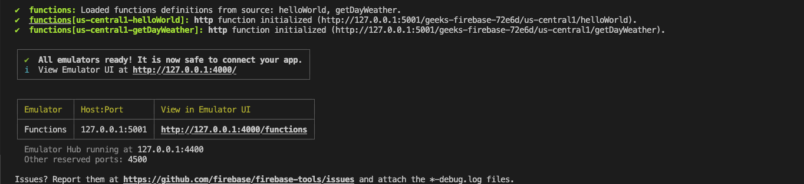

# Firebase Overview

Firebase is a Backend-as-a-Service (BaaS) platform developed by Google. It provides a variety of services and tools that developers can use to build, improve, and grow their applications. Firebase allows developers to focus on creating fantastic user experiences without having to manage the server-side of things. Here are some of the key features of Firebase:

1. **Realtime Database**: This is a NoSQL database that allows you to store and synchronize data between your users in real-time. This is ideal for applications where data needs to be synced across clients quickly, such as live collaboration tools or multiplayer games.

2. **Firestore**: This is another NoSQL database but offers more features than the Realtime Database. Firestore structures data as collections of documents and offers robust querying, offline support, and real-time updates.

3. **Authentication**: Firebase Auth provides a full-featured authentication system that supports email & password, phone number, and social login (like Google, Facebook, Twitter) and more. It also handles things like password resets, account verification, etc.

4. **Cloud Storage**: Firebase provides storage solutions for files like images, videos, and other user content. It integrates with Firebase's security and authentication to provide file uploads/downloads securely.

5. **Hosting**: Firebase Hosting provides a fast, secure, and reliable way to host your web app's static and dynamic content. It's backed by a global CDN (Content Delivery Network), offers custom domain support and SSL certificates for free.

6. **Cloud Functions**: This feature allows you to run your own custom backend code in response to events triggered by Firebase features and HTTPS requests. The code you write is stored in Google's cloud and runs in a managed environment.

7. **Analytics**: Google Analytics for Firebase offers free, unlimited reporting on up to 500 distinct events, allowing you to understand how users interact with your app.

etc..

Firebase's suite of services simplifies a lot of the challenges in web and app development. Each of these services can be used independently as per your requirements, or together, they work well as a unified platform. Their integration with other Google services also adds a lot of value. For beginners, Firebase provides a great way to learn about and implement various backend functionalities without needing to manage server infrastructure.

In this course, we'll only be focusing on three Firebase services.

- Cloud Functions
- Firestore
- Authentication

The following is an example of how these services might be used in an application to register a user



## Project (Weather App)

Today we are only going to be looking at the Firebase functions service. As mentioned above, functions integrate nicely with other Firebase service's based on an event system. We'll get more into that when we start talking about authentication and Firestore; for now, we'll just be looking at setting up http(s) endpoints to serve our client side React app.

Today we'll be using our first REST API (Representational State Transfer API). We're going to be building a weather app that tracks the conditions for a specific location. Weather data will be pulled in from weather api https://www.weatherapi.com/docs/.

1. First we'll create a free account
2. Grab our API key (used for rate limiting)
3. Inside, `functions/` create a .env file that contains 1 line `WEATHER_API_KEY="YOUR_WEATHER_API_KEY_GOES_HERE"`
4. Start up firebase function emulator, inside of `functions/` run `npm run serve`

You should see something like the following


Here we can see two https endpoints, `helloWorld` and `getDayWeather`. These endpoints are now available for our React app to consume or any http client for that matter.

For example, using `curl http://127.0.0.1:5001/geeks-firebase-72e6d/us-central1/helloWorld` we get

```
Hello from Firebase!
```

If we do `curl http://localhost:5001/geeks-firebase-72e6d/us-central1/getDayWeather` we get a very long output with all the weather data for the day in Miami.

### Why

You might be wondering why don't we just make these API calls directly in our React application. Its a good question, the answer is twofold.

- Security
- Separation of concerns

**Security**: In order for us to use the weather api, we needed to create an account to receive an api key. This api was free but most are not. These keys should kept as secret/safe as your credit card details. If api keys fall into the wrong hands then it might cost you a lot of money and stress. To avoid having these keys become vulnerable, we want to avoid embedding it in client side javascript at any cost. This is because every visitor of your web app essentially has access to your entire javascript bundle; this is very bad for security. Thus, we want to delegate the responsibility to a backend that can maintain our key secret while this providing access for our React app.

**Separation of Concerns**: One of the basic tenants of writing good code. React is a web UI library. Thus its main responsibility to render the UI components of a web application. We don't also want to start mixing in making API calls, parsing the output, massaging the data, etc... Frontends should contain minimal logic. Let the backend handle the computation and the frontend handles presentation.

There are other reasons as well such as authentication, database, rate limiting, etc but these are still advanced concepts to us at the moment.
